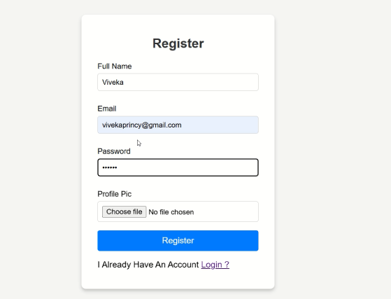
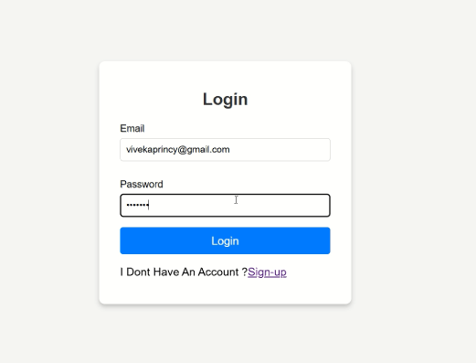
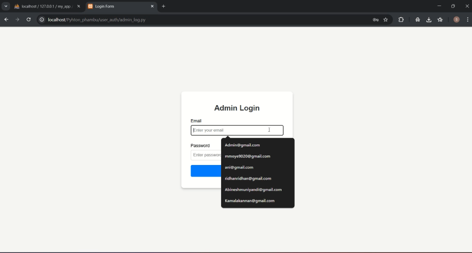
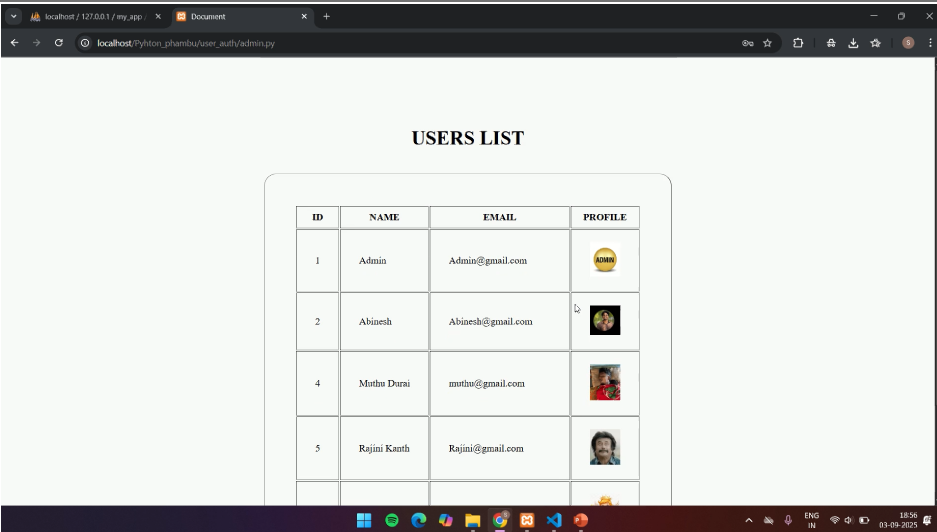

# 🔐 User Authentication using CGI (Python)

A simple **user authentication system** built with **Python CGI** for handling user registration and login functionality.

## ✨ Features
- 📝 User registration with username & password  
- 🔑 Secure login system  
- 📂 Stores user details safely  
- 🌐 CGI-based web interface  

## 🚀 Getting Started

### 1. Clone the Repository
```bash
git clone https://github.com/Suryaprasath11/User-Authentication-using-CGI-pyhton.git
cd User-Authentication-using-CGI-pyhton
```

2. Setup

Make sure you have Python 3 installed

Place the project files in your server’s CGI directory (e.g., /cgi-bin/)

Run the project through a browser using http://localhost/cgi-bin/...

📸 Demo

## 📸 Demo

<p align="center">
  
  
  
  
  
</p>

🤝 Contributing

Pull requests are welcome!

📜 License

This project is open-source under the MIT License.


```yaml

   This will give your repo a **professional and modern look** with icons, sections, and instructions.  
  
  Do you want me to also add **badges (Python version, license, etc.)** at the top for an even cooler style.
```
